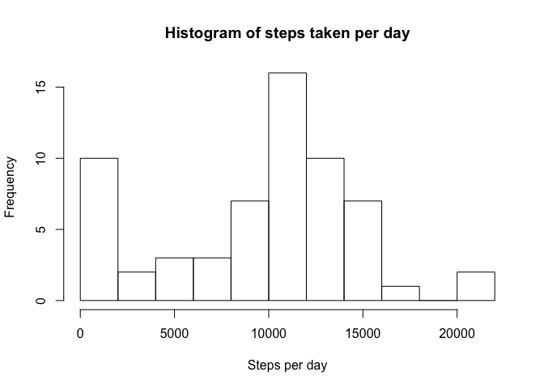
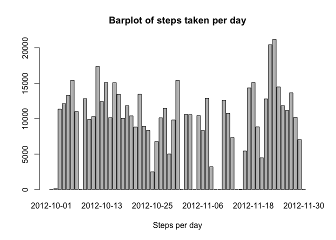
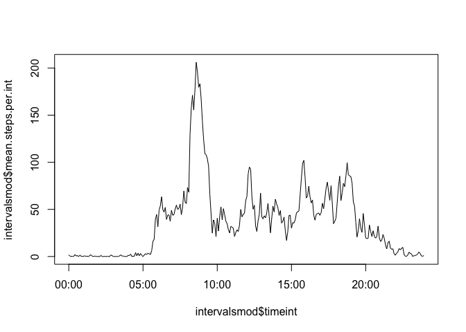
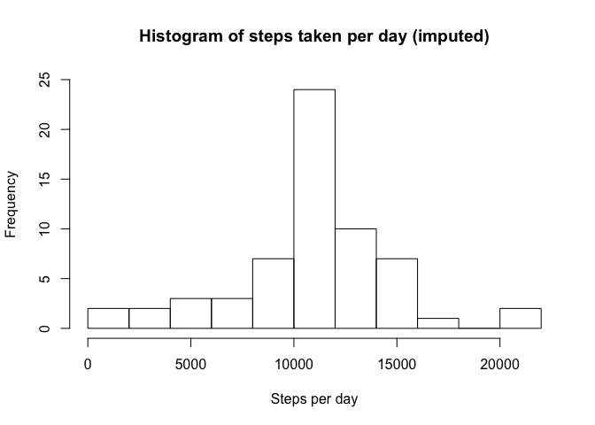
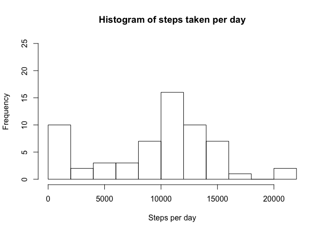
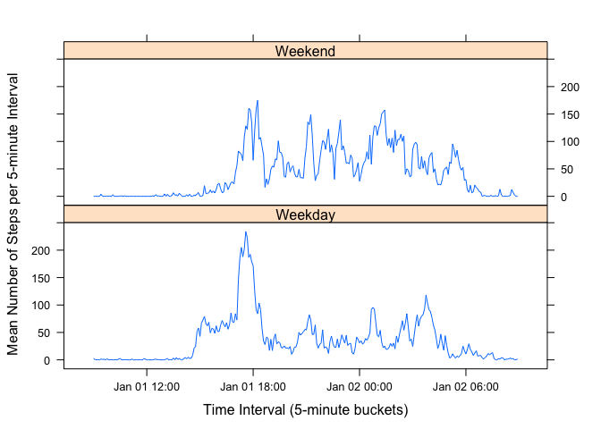

# Reproducible Research: Peer Assessment 1


## Loading and preprocessing the data

### 1. Read the data
Download the data in .zip format, unzip the file, and read it in with the
following commands.


```r
dataurl <- "https://d396qusza40orc.cloudfront.net/repdata%2Fdata%2Factivity.zip"
download.file(dataurl, "activity.zip")
unzip("activity.zip", "activity.csv")
activity <- read.csv("activity.csv")
```

The object "activity" contains the data read directly from the downloaded file.
Let's look at the structure and the head of activity:


```r
str(activity)
```

```
## 'data.frame':	17568 obs. of  3 variables:
##  $ steps   : int  NA NA NA NA NA NA NA NA NA NA ...
##  $ date    : Factor w/ 61 levels "2012-10-01","2012-10-02",..: 1 1 1 1 1 1 1 1 1 1 ...
##  $ interval: int  0 5 10 15 20 25 30 35 40 45 ...
```

```r
head(activity, n = 15)
```

```
##    steps       date interval
## 1     NA 2012-10-01        0
## 2     NA 2012-10-01        5
## 3     NA 2012-10-01       10
## 4     NA 2012-10-01       15
## 5     NA 2012-10-01       20
## 6     NA 2012-10-01       25
## 7     NA 2012-10-01       30
## 8     NA 2012-10-01       35
## 9     NA 2012-10-01       40
## 10    NA 2012-10-01       45
## 11    NA 2012-10-01       50
## 12    NA 2012-10-01       55
## 13    NA 2012-10-01      100
## 14    NA 2012-10-01      105
## 15    NA 2012-10-01      110
```

```r
maxinterval <- max(activity$interval)
maxinterval
```

```
## [1] 2355
```

### 2. Transform the data as necessary into a format suitable for the analysis
As you can see, the variable "interval" goes from 0 to 55 then jumps to 100.
The maximum value is 2355 
This is because interval is an integer of up to four digits, with the format
hhmm, where the thousands and hundreds places are the two-digit hour, and the
tens and ones digits are the two-digit minute that starts the five minute 
interval.


In order to make interval more useful, we can convert the four-digit
integer version of interval to a POSIX time variable as follows. First, comvert
the four digit integer in hhmm format to "hh:mm" in character format.


```r
allintervals <- as.integer(names(table(activity$interval)))
hours <- floor(allintervals/100)
mins <- activity$interval - hours * 100
hoursmins <- paste(hours, mins, sep = ":")
```

Next, convert the character string "hh:mm" to POSIX time and then make a
table intconvert that can be used with the merge function to add a column 
in which the interval in hhmm is converted to a POSIX time:

```r
timeints <- as.POSIXct(hm(hoursmins), origin = "1970-01-01", tz = "GMT")
activitymod <- transmute(activity, steps = steps, timeint = timeints)
intconvert <- data.frame(interval=allintervals, timeint=as.POSIXct(timeints))
```


## What is mean total number of steps taken per day?
### 1. Calculate the total number of steps taken per day

Let's group the activity data by date, then sum by date, and call the
resulting dataframe "days". Then look at days to see check the format, and look
at the summary of days to get some basic information about the dataframe.

For the moment, the NA values are simply ignored. Later, the missing values
will be imputed.

```r
days <- group_by(activity, date) %>% 
    summarize(tot.steps.per.day = sum(steps, na.rm = TRUE))
head(days)
```

```
## # A tibble: 6 x 2
##         date tot.steps.per.day
##       <fctr>             <int>
## 1 2012-10-01                 0
## 2 2012-10-02               126
## 3 2012-10-03             11352
## 4 2012-10-04             12116
## 5 2012-10-05             13294
## 6 2012-10-06             15420
```

```r
summary(days)
```

```
##          date    tot.steps.per.day
##  2012-10-01: 1   Min.   :    0    
##  2012-10-02: 1   1st Qu.: 6778    
##  2012-10-03: 1   Median :10395    
##  2012-10-04: 1   Mean   : 9354    
##  2012-10-05: 1   3rd Qu.:12811    
##  2012-10-06: 1   Max.   :21194    
##  (Other)   :55
```

### 2. Make histogram (vs. barchart) of total steps per day

Histograms and barcharts are easy to confuse. Let's look at a histogram and a
barchart of the data to see the difference. 

```r
hist(days$tot.steps.per.day, 
     breaks = 10, 
     xlab = "Steps per day", 
     main = "Histogram of steps taken per day")
```

<!-- -->

```r
barplot(days$tot.steps.per.day,
        xlab = "Steps per day",
        names.arg = days$date,
        main = "Barplot of steps taken per day")
```

<!-- -->

So the difference is that barchart simply plots the value for each day, while
histogram groups the number of steps into "buckets" and plots the number of days
in each bucket ot get a sense of the frequency that different numbers of steps
occur.

### 3. Calculate and report mean and median steps per day


```r
summary(days$tot.steps.per.day)
```

```
##    Min. 1st Qu.  Median    Mean 3rd Qu.    Max. 
##       0    6778   10395    9354   12811   21194
```


From the table above, it can be seen that the mean number of steps taken per day
is 9354 and the median is 10395.


## What is the average daily activity pattern?

### 1. Make a time series plot of steps taken in each time interval

First, break up the activity data into interval, then take the mean value
for each interval (skipping NAs). This results in an average for each value of
interval (0-55, 100-155, etc.)

```r
intervals <- group_by(activity, interval) %>%
    summarize(mean.steps.per.int = mean(steps, na.rm = TRUE))
```

In order to plot normally, interpreting intervals as time values and avoiding
jumps between 55 and 100, between 155 and 200, etc., convert the intervals to 
actual times:

```r
intervalsmod <- merge(intervals,intconvert)
plot(intervalsmod$timeint, intervalsmod$mean.steps.per.int, type = "l")
```

<!-- -->

### 2. Which 5-minute interval contains the maximum number of steps?

Find the maximum number of steps, then find which time bucket has the maximum
number of steps.


```r
maxsteps <- max(intervals$mean.steps.per.int)
maxsteps
```

```
## [1] 206.1698
```

```r
maxint <- intervals[which(intervals$mean.steps.per.int == maxsteps),1][[1]]
maxint
```

```
## [1] 835
```

So the interval with the maximum average steps per day is 206
which occurs between 835 and 840


## Imputing missing values

### 1. Calculate and report number of missing values

The number of NAs, the total number of records, and the rate of occurance of
NAs is as follows:

```r
sum(is.na(activity$steps))
```

```
## [1] 2304
```

```r
length(activity$steps)
```

```
## [1] 17568
```

```r
sum(is.na(activity$steps))/length(activity$steps)
```

```
## [1] 0.1311475
```

### 2. Devise a strategy to fill in missing values

Now I will create a dataframe called imputedactivity (to maintain the integrity
of the original dataframe called activity). In that dataframe, I will first add
in a column which contains the average number of steps in each interval, where
NAs were excluded. These averages were calculated earlier and stored in the 
dataframe intervals.

```r
imputedactivity <- activity
imputedactivity <- merge(activity, intervals)
head(imputedactivity)
```

```
##   interval steps       date mean.steps.per.int
## 1        0    NA 2012-10-01           1.716981
## 2        0     0 2012-11-23           1.716981
## 3        0     0 2012-10-28           1.716981
## 4        0     0 2012-11-06           1.716981
## 5        0     0 2012-11-24           1.716981
## 6        0     0 2012-11-15           1.716981
```

### 3. Create a new dataset equal to the original but with imputed values

I create a dataframe called imputedactivity that is the same as activity, but
with NA values replaced by the mean for that interval across the other days.


```r
nasteps <- is.na(imputedactivity$steps)
imputedactivity$steps[nasteps] <- 
    imputedactivity$mean.steps.per.int[nasteps]
imputedactivity <- select(imputedactivity, -mean.steps.per.int)
head(imputedactivity)
```

```
##   interval    steps       date
## 1        0 1.716981 2012-10-01
## 2        0 0.000000 2012-11-23
## 3        0 0.000000 2012-10-28
## 4        0 0.000000 2012-11-06
## 5        0 0.000000 2012-11-24
## 6        0 0.000000 2012-11-15
```

```r
daysimputed <- group_by(imputedactivity, date) %>% 
    summarize(tot.steps.per.day = sum(steps, na.rm = TRUE))
```


### 4. Make a histogram, and find mean and median for imputed dataset

First, I create the summary statistics and print out the mean and median.


```r
summary(daysimputed$tot.steps.per.day)
```

```
##    Min. 1st Qu.  Median    Mean 3rd Qu.    Max. 
##      41    9819   10766   10766   12811   21194
```

```r
mean.tot.steps.per.day.imp <- mean(daysimputed$tot.steps.per.day)
mean.tot.steps.per.day.imp
```

```
## [1] 10766.19
```

```r
median.tot.steps.per.day.imp <- median(daysimputed$tot.steps.per.day)
median.tot.steps.per.day.imp
```

```
## [1] 10766.19
```

Then I make histograms of the data with imputed values and then print a 
histogram of the original data for easy reference.


```r
hist(daysimputed$tot.steps.per.day, 
     breaks = 10, 
     xlab = "Steps per day", 
     main = "Histogram of steps taken per day (imputed)",
     ylim = c(0,25))
```

<!-- -->

```r
hist(days$tot.steps.per.day, 
     breaks = 10, 
     xlab = "Steps per day", 
     main = "Histogram of steps taken per day",
     ylim = c(0,25))
```

<!-- -->

So the histograms can be seen to be different because of the absence of NA
values. This leads to some days with zero steps (due to NAs) having an average
number of steps. The mean steps per day with imputed data is 
10766 vs.
9354 for the raw data.

## Are there differences in activity patterns between weekdays and weekends?

### 1. Create a new factor variable for weekend and weekday

In order to check this, we need to break up the data. The following groups
activity by interval, then summarizes dates as weekend days or not (using the 
is.weekend() function in the chron library), then takes the means.

```r
intervals.wend <- group_by(activity, interval) %>%
    group_by(wend = is.weekend(date), add = TRUE) %>%
    summarize(mean.steps.per.int = mean(steps, na.rm = TRUE))
```


```r
intervals.mod.wend <- merge(intervals.wend, intconvert)
```

### 2. Make a panel plot of the steps per interval split by weekend vs. weekday
In order to make the plots have appropriate chart titles, the following will
convert is.weekend() = TRUE to the character string "Weekend" and FALSE to 
"Weekday".


```r
intervals.mod.wend$wend <- 
    factor(intervals.mod.wend$wend, 
           levels = c(FALSE, TRUE), 
           labels = c("Weekday", "Weekend"))
```

Finally, use the lattice plotting to make up-and-down plots of the average 
number of steps per 5-minute time bucket for weekends vs. weekdays.


```r
with(intervals.mod.wend,
     xyplot(mean.steps.per.int ~ timeint | wend, 
     layout = c(1,2),
     xlab = "Time Interval (5-minute buckets)",
     ylab = "Mean Number of Steps per 5-minute Interval",
     type = "l"))
```

<!-- -->
